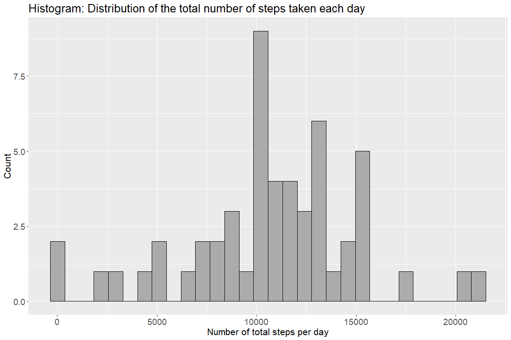
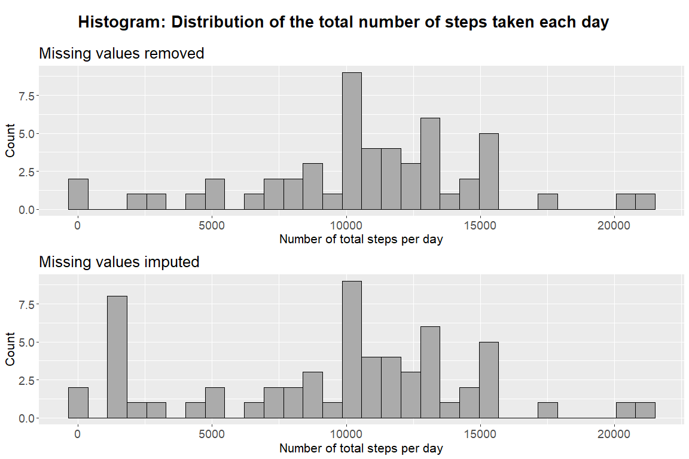
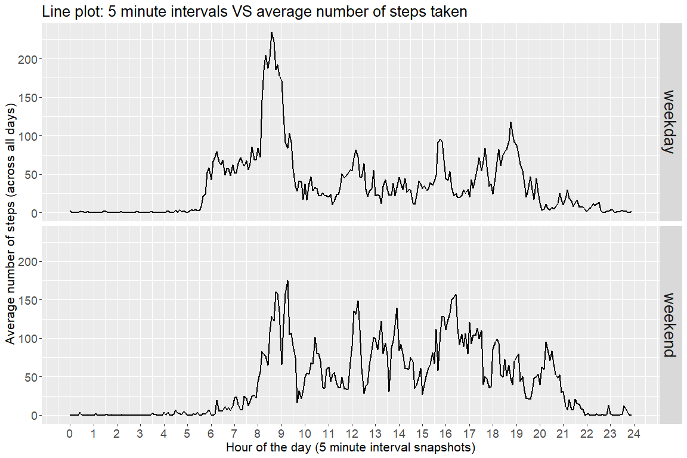

```r
rm(list = ls())
graphics.off()

# Load R packages
packages <- c("dplyr", "ggplot2", "lubridate", "stringr", "cowplot") # list of packages to load

package.check <- lapply( # load or install & load list of packages
  packages,
  FUN = function(x) {
    if (!require(x, character.only = TRUE)) {
      install.packages(x, dependencies = TRUE)
      library(x, character.only = TRUE)
    }
  }
) 
rm(packages, package.check)
```


## Loading and preprocessing the data


```r
# if csv is still in .zip file first unzip iz
if(!file.exists("activity.csv")){
  unzip(zipfile = "activity.zip")
}

# import data
df <- read.csv(file = "activity.csv", header = T)

# data pre-processing
df <- df %>% 
  mutate(hour_minute = as.character(interval), # convert interval to character to get hour minute
         hour_minute = str_pad(string = interval, # pad with leading zeros
                               width = 4, 
                               side = "left", 
                               pad = "0"), 
         hour = as.numeric(str_sub(string = hour_minute, start = 1, end = 2)), # extract only hours
         minute = as.numeric(str_sub(string = hour_minute, start = 3, end = 4)), # extract only minutes
         timestamp = paste(date, " ", hour_minute, sep = ""), # paste date and time together
         date = ymd(date), # convert date column to date class
         timestamp = ymd_hm(timestamp), # convert to datetime object
         minutes_in_day = hour * 60 + minute) %>% # calculate minutes in the day
  select(-hour_minute) # drop column
```


## What is mean total number of steps taken per day?

Total number of steps taken per day:

```r
df.steps.tot <- df %>% 
  filter(!is.na(steps)) %>% 
  group_by(date) %>% # calculate per day (total)
  summarise(`steps total` = sum(steps, na.rm = T)) %>% # total steps
  ungroup() 
```


Histogram of the total number of steps taken each day:


```r
df.steps.tot %>%
  ggplot(aes(x = `steps total`)) +
  geom_histogram(bins = 30, color = "black", fill = "gray67") +
  xlab("Number of total steps per day") +
  ylab("Count") +
  ggtitle("Histogram: Distribution of the total number of steps taken each day") +
  theme(text = element_text(size = 16),
        axis.text = element_text(size = 14))
```

<!-- -->


Mean and median of total number of steps taken per day:

```r
df.steps.tot %>% 
  summarise(`mean of total steps per day` = mean(`steps total`), # mean of total steps per day
            `median of total steps per day` = median(`steps total`)) # median of total steps per day
```

```
## # A tibble: 1 x 2
##   `mean of total steps per day` `median of total steps per day`
##                           <dbl>                           <int>
## 1                        10766.                           10765
```


## What is the average daily activity pattern?

Average number of steps taken per 5-min interval (all days):

```r
df.steps.interval.avg <- df %>% 
  group_by(minutes_in_day, interval, hour, minute) %>% # calculate per day (total)
  summarise(`steps avg` = mean(steps, na.rm = T)) %>% # total steps
  ungroup() 
```

Time series plot of 5-minute interval (x-axis) and the average number of steps taken, averaged across all days (y-axis).


```r
df.steps.interval.avg %>% 
  ggplot(aes(x = minutes_in_day, y = `steps avg`)) +
  geom_line(size = 0.8) +
  scale_x_continuous(breaks = seq(0,60*24, 60), labels = seq(0,24)) +
  xlab("Hour of the day (5 minute interval snapshots)") +
  ylab("Average number of steps (across all days)") +
  ggtitle("Line plot: 5 minute intervals VS average number of steps taken") +
  theme(text = element_text(size = 16),
        axis.text = element_text(size = 14))
```

<!-- -->

Which 5-minute interval, on average across all the days in the dataset, contains the maximum number of steps?


```r
df.steps.interval.avg %>% 
  select(interval, hour, minute, `steps avg`) %>% 
  arrange(desc(`steps avg`)) %>% 
  head(1)
```

```
## # A tibble: 1 x 4
##   interval  hour minute `steps avg`
##      <int> <dbl>  <dbl>       <dbl>
## 1      835     8     35        206.
```


## Imputing missing values

Calculate and report the total number of missing values in the dataset:

```r
df %>% 
  mutate(`missing values` = case_when(is.na(steps) ~ TRUE,
                                      T ~ FALSE)) %>% 
  group_by(`missing values`) %>% 
  count() %>% 
  ungroup() %>% 
  mutate(`percentage %` = round(n / sum(n) * 100, 1)) %>% 
  rename(`number of rows` = n) %>% 
  arrange(desc(`missing values`))
```

```
## # A tibble: 2 x 3
##   `missing values` `number of rows` `percentage %`
##   <lgl>                       <int>          <dbl>
## 1 TRUE                         2304           13.1
## 2 FALSE                       15264           86.9
```


Strategy to fill missing values in the data set:

1. Calculate median number of steps for each 5 minute interval (across all days)
2. If data is missing in given interval fill missing values (impute) with median for that interval (step 1)

Create a new dataset that is equal to the original dataset but with the missing data filled in:

```r
df.nomissing <- df %>% 
  group_by(interval) %>% # for each interval (across all dates)
  mutate(`steps median interval` = median(steps, na.rm = T)) %>% # calculate median (for interval)
  ungroup() %>% 
  mutate(`steps imputed` = case_when(is.na(steps) ~ `steps median interval`, # impute values
                                     !is.na(steps)~ steps))
```

Total number of steps taken per day (missing values removed):

```r
df.steps.nomissing.tot <- df.nomissing %>% 
  group_by(date) %>% # calculate per day (total)
  summarise(`steps total` = sum(`steps imputed`, na.rm = T)) %>% # total steps
  ungroup() 
```


Make a histogram of the total number of steps taken each day:

```r
plot.hist1 <- df.steps.tot %>% 
  ggplot(aes(x = `steps total`)) +
  geom_histogram(bins = 30, color = "black", fill = "gray67") +
  xlab("Number of total steps per day") +
  ylab("Count") +
  ggtitle("Missing values removed") +
  theme(text = element_text(size = 16),
        axis.text = element_text(size = 14))

plot.hist2 <- df.steps.nomissing.tot %>% 
  ggplot(aes(x = `steps total`)) +
  geom_histogram(bins = 30, color = "black", fill = "gray67") +
  xlab("Number of total steps per day") +
  ylab("Count") +
  ggtitle("Missing values imputed") +
  theme(text = element_text(size = 16),
        axis.text = element_text(size = 14))

title <- ggdraw() + draw_label("Histogram: Distribution of the total number of steps taken each day",
                              fontface = 'bold', size = 20)
plot <- plot_grid(plot.hist1, plot.hist2, nrow = 2)
plot_grid(title, plot, rel_heights = c(0.1, 1), nrow = 2)
```

<!-- -->

 Calculate and report the mean and median total number of steps taken per day.


```r
missing.removed <- df.steps.tot %>% 
  summarise(`mean tot steps day` = mean(`steps total`), # mean of total steps per day
            `median tot steps day` = median(`steps total`)) # median of total steps per day

missing.imputed <- df.steps.nomissing.tot %>% 
  summarise(`mean tot steps day` = mean(`steps total`), # mean of total steps per day
            `median tot steps day` = median(`steps total`)) # median of total steps per day

bind_rows(missing.removed,
          missing.imputed) %>% 
  mutate(`Data type` = c("missing removed", 
                         "missing  imputed")) %>% 
  select(`Data type`, everything())
```

```
## # A tibble: 2 x 3
##   `Data type`      `mean tot steps day` `median tot steps day`
##   <chr>                           <dbl>                  <int>
## 1 missing removed                10766.                  10765
## 2 missing  imputed                9504.                  10395
```

We can see if we impute missing values (with median value for interval) the mean and median of total steps in the day decreases. You can see from both histograms that after imputation and calculation of total steps per day, there is a spike of at around 2000 total steps per day (check histogram with imputed values). Since median and average of total steps (when missing values are removed) is over 2000 (at around 10000), therefore this additional spike (imputed values) decreases the median and average of total daily steps (mean is decreased for over 1000 steps and median is decreased for around 350 steps).  

## Are there differences in activity patterns between weekdays and weekends?

Create a new factor variable in the dataset with two levels – “weekday” and “weekend” indicating whether a given date is a weekday or weekend day.


```r
df.nomissing <- df.nomissing %>% 
  mutate(DOW = wday(date, week_start = 1), # add number for day of week
         weekday = case_when(DOW <= 5 ~ "weekday",  # add flag weekday or weekend
                             DOW > 5 ~ "weekend"),
         weekday = factor(weekday, levels = c("weekday", "weekend"))) # convert to factor
```

Make a panel plot containing a time series plot of the 5-minute interval (x-axis) and the average number of steps taken, averaged across all weekday days or weekend days (y-axis). 


```r
df.nomissing %>% 
  group_by(weekday, minutes_in_day, interval, hour, minute) %>% # calculate per day (total)
  summarise(`steps avg` = mean(steps, na.rm = T)) %>% # total steps
  ungroup() %>% 
  ggplot(aes(x = minutes_in_day, y = `steps avg`)) +
  geom_line(size = 0.8) +
  scale_x_continuous(breaks = seq(0,60*24, 60), labels = seq(0,24)) +
  facet_grid(weekday ~ .) +
  xlab("Hour of the day (5 minute interval snapshots)") +
  ylab("Average number of steps (across all days)") +
  ggtitle("Line plot: 5 minute intervals VS average number of steps taken") +
  theme(text = element_text(size = 16),
        axis.text = element_text(size = 14),
        strip.text = element_text(size = 20))
```

<!-- -->

